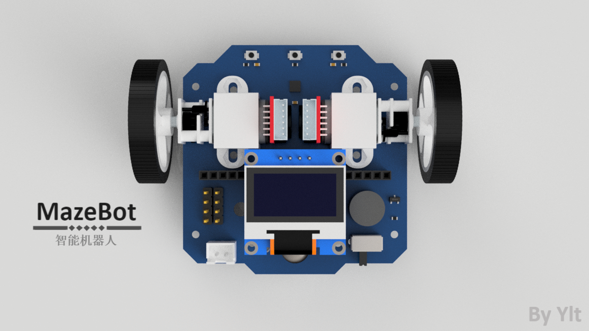
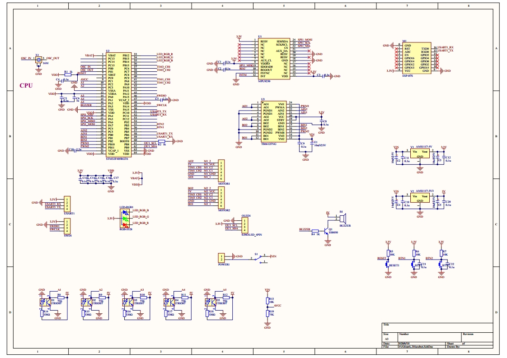
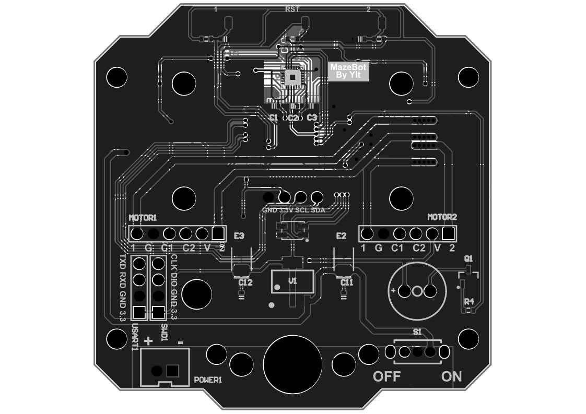
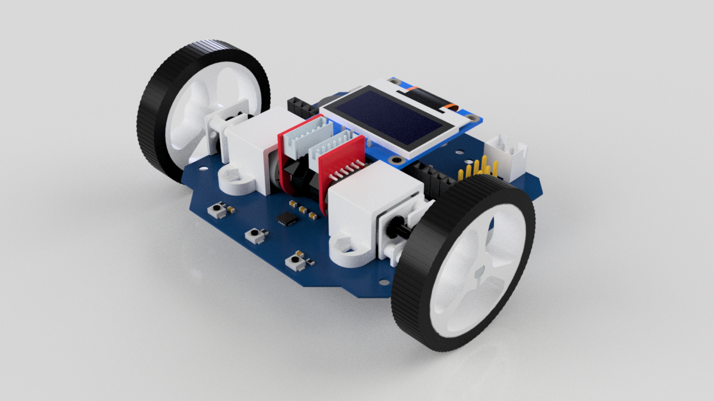
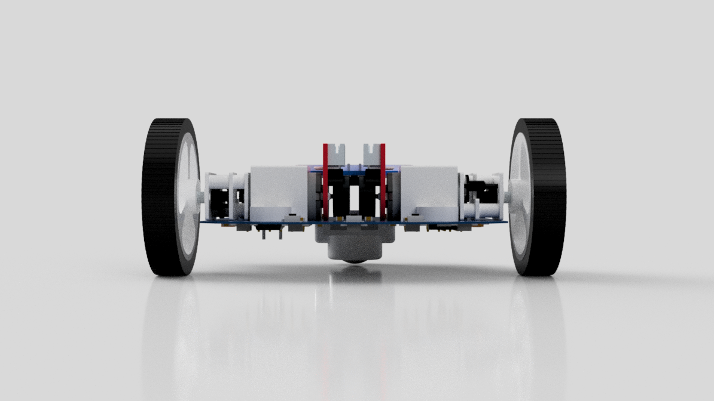

> 📖 本项目更新于 2020 年 08 月 12 日

MazeBot 始于2020年四月份，作为一个机器人研究者和爱好者，希望有一个硬件作为载体满足自己的软件的实验。

**我将持续更新该项目的进展**

### MazeBot的硬件资源：

| 元件       | 型号          | 说明                           |
| ---------- | ------------- | :----------------------------- |
| 处理器     | STM32F405RGT6 | 160MHZ主频 DSP浮点加速         |
| 驱动器     | TB6612        | 双路直流电机驱动器             |
| 通讯       | ESP07S        | 安信可WiFi芯片                 |
| 电机       | N20           | 带正交编码器的直流有刷减速电机 |
| 陀螺仪     | mpu9250       | invensense的9轴姿态传感器      |
| 光电传感器 | ITR8307       | 收发一体的反射式光电传感器     |
| 显示器     | 0.96oled      | SSD1306白黑oled                |

<!-- more -->

### MazeBot能够用来干什么呢：

- 首先作为一个双轮差速的小车，能够提供最高1m/s的移动速度；
- 通过直流电机编码器反馈与mpu9250陀螺仪信息融合获得可靠的里程计信息；
- 前置五个光电传感器实现巡线学习；
- oled与三个操作按键进行人机交互；
- WiFi与上位机相连获取信息与控制；

---

### 我准备MazeBot做什么：

- 使用OPEN AI 训练其进行巡线；
- 使用模型优化轨迹跟踪算法的参数；

---

### 现在MazeBot完成了哪些部分：

- 电机速度闭环与位置闭环；
- 陀螺仪读取与矫正；
- 基于编码器与陀螺仪的里程计；
- Wifi AP模式和Station模式与上位机通信；
- 光电传感器对白线与黑线的识别；
- 轨迹规划与跟踪算法；

---

### 原理图和PCB

### 渲染图

> 

